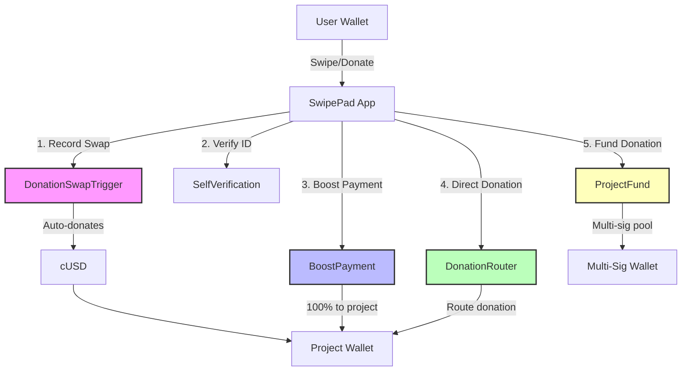

cat > docs/architecture/README.md << 'EOF'
# SwipePad Smart Contract Architecture

## Overview
SwipePad uses 5 core smart contracts to manage donations, boosting, and identity verification on Celo.

## Contracts

### 1. DonationSwapTrigger (`contracts/donation/DonationSwapTrigger.sol`)
- **Purpose**: Automatically triggers donations after N swaps
- **Key Functions**:
  - `recordSwap()`: Called by SwipePad app after each swap
  - Automatically transfers cUSD to project wallet when threshold reached
- **Parameters**: Configurable thresholds (20, 30, 40 swaps)

### 2. BoostPayment (`contracts/boost/BoostPayment.sol`)
- **Purpose**: Handles payments for project ranking boosts
- **Key Functions**:
  - `purchaseBoost()`: Projects pay cUSD to boost ranking
  - `getTopProjects()`: Returns top 10 boosted projects
- **Features**: 
  - Zero-fee for SwipePad (100% to project)
  - 30-day boost duration
  - Automated ranking system

### 3. DonationRouter (`contracts/direct-donation/DonationRouter.sol`)
- **Purpose**: Intermediary for direct donations (0% fee)
- **Key Functions**:
  - `donate()`: Routes cUSD from donor to project
- **Benefits**: 
  - Transparent donation records on-chain
  - Optional memos/messages
  - Donor & project history tracking

### 4. ProjectFund (`contracts/funds-pool/ProjectFund.sol`)
- **Purpose**: Multi-sig managed donation pools
- **Key Functions**:
  - `createFund()`: Creates purpose-specific fund
  - `donateToFund()`: Donates to specific fund
  - `proposeWithdrawal()`: Multi-sig withdrawal proposal
- **Features**: 
  - Configurable signer requirements
  - Purpose-specific allocation (e.g., "Climate Fund")
  - Governance-ready

### 5. SelfVerification (`contracts/identity/SelfVerification.sol`)
- **Purpose**: Bridge to Self Protocol for identity verification
- **Key Functions**:
  - `verifyUser()`: Oracle updates verification status
  - `isVerified()`: Checks if user is verified
- **Integration**: Ensures KYC/identity before large donations

## Flow Diagram
See: `docs/diagrams/swipepad-contract-flow.mmd`

## Deployment Addresses (Celo Mainnet)
- cUSD: `0x765DE816845861e75A25fCA122bb6898B8B1282a`
- Self Protocol Oracle: `[CONFIGURE]`

## Security
- All contracts use OpenZeppelin's ReentrancyGuard
- AccessControl for admin functions
- SafeERC20 for token transfers
- Multi-sig protection for fund withdrawals
EOF

cat > README.md << 'EOF'
# SwipePad - Smart Contracts

Automated donation platform on Celo with smart contract-powered giving.

## 📊 Contract Flow

